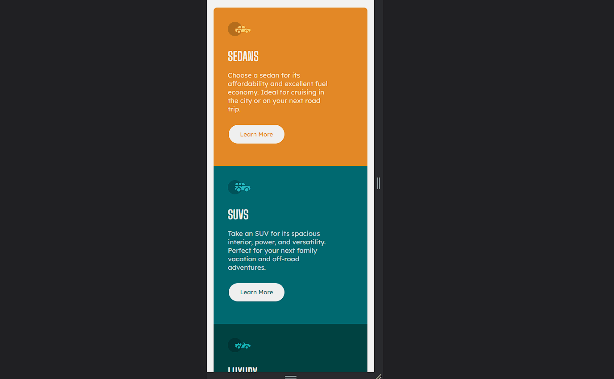
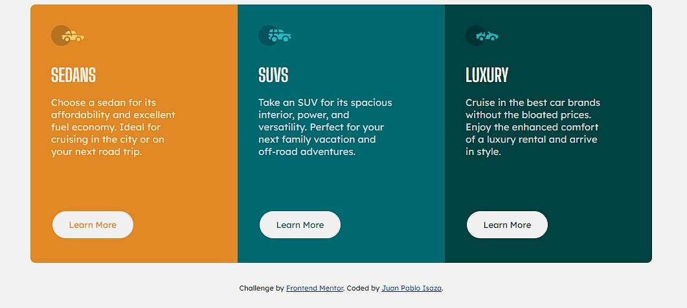

# Frontend Mentor - 3-column preview card component solution

This is a solution to the [3-column preview card component challenge on Frontend Mentor](https://www.frontendmentor.io/challenges/3column-preview-card-component-pH92eAR2-). Frontend Mentor challenges help you improve your coding skills by building realistic projects.

## Table of contents

- [Overview](#overview)
  - [The challenge](#the-challenge)
  - [Screenshot](#screenshot)
  - [Links](#links)
- [My process](#my-process)
  - [Built with](#built-with)
  - [What I learned](#what-i-learned)
- [Author](#author)

## Overview

### The challenge

Users should be able to:

- View the optimal layout depending on their device's screen size
- See hover states for interactive elements

### Screenshot

### Links

- Solution URL: [GitHub Repo](https://github.com/jisazamp/3-column-preview-card-component)
- Live Site URL: [GitHub Pages Live Preeview](https://jisazamp.github.io/3-column-preview-card-component/)

## My process

### Built with

- Semantic HTML5 markup
- CSS custom properties
- Flexbox
- Mobile-first workflow

### What I learned

I had no problems with this challenge. The only thing is that I didn't focus on making it pixel perfect, but rather on having fun and applying the layout and responsive designs.

## Author

- Website - [GitHub Profile](https://www.github.com/jisazamp)
- Frontend Mentor - [@jisazamp](https://www.frontendmentor.io/profile/jisazamp)
